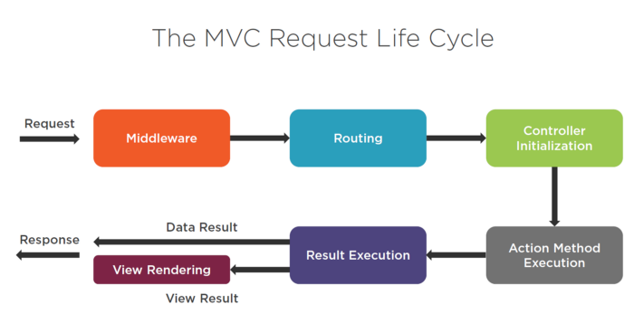
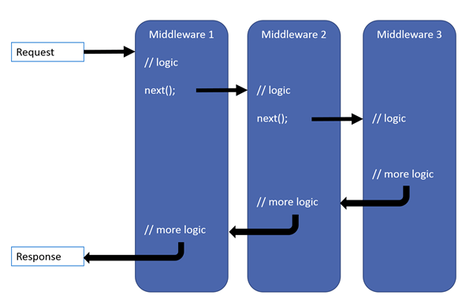

# Middlewares
- In a web application, we may want to perform *intermediary operations* and *influence the progression of the process* **from receiving a request from the client to generating the corresponding response**.
- Middleware processes can be before or after the initialization of controllers. *Initialisation of controllers is also a middleware.*

- Middleware is software that's assembled into an app pipeline to handle requests and responses. Each component:
    - Chooses whether to pass the request to the next component in the pipeline.
    - Can perform work before and after the next component in the pipeline.
### MVC Pipeline

### More information: [ASP.NET Core Middleware](https://learn.microsoft.com/en-us/aspnet/core/fundamentals/middleware/?view=aspnetcore-8.0)

- Like recursion logic, middleware processes are performed as chains. After a middleware is triggered, it can trigger other middleware and wait for its return. This sequential execution allows each middleware to perform specific tasks in a modular and isolated manner, contributing to the overall request processing flow.

- This chain makes incoming request goes through various processes until a response is returned.

- As each middleware executes its logic and potentially modifies the request or response, it can pass control to the next middleware in the chain using the `next` delegate.

- This pattern of chaining middleware provides flexibility and extensibility to web applications, allowing developers to compose complex request-handling pipelines efficiently.

- Each middleware component focuses on a specific aspect of request processing, such as authentication, logging, or routing, ensuring separation of concerns and promoting code reusability. Additionally, middleware can modify the request or response context, transform data, handle errors, or terminate the pipeline based on specific conditions, making them a powerful tool for customizing and controlling the behavior of web applications.

- Each delegate can perform operations before and after the next delegate. Exception-handling delegates should be called early in the pipeline, so they can catch exceptions that occur in later stages of the pipeline.

### Middleware Properties:
- Middlewares names start with **``Use``**. For example: **Use**Routing(), **Use**Authorization(), **Use**Endpoints().
- The order in which middlewares are triggered is crucial. For example: **UseAuthentication()** is called before **UseAuthorization()**, **UseRouting()** must come before **UseEndpoints()**, **UseCors()** must come before **UseRouting()**.

### ASP.NET Core Middlewares
Empty middlewares that can be configured by developer.
1) Run: It breaks the chain after itself and returns to the beginning of the pipeline. Middlewares after Run Middleware are not triggered. This is called *``short-circuit``* behaviour.
- Use
- Map
- MapWhen